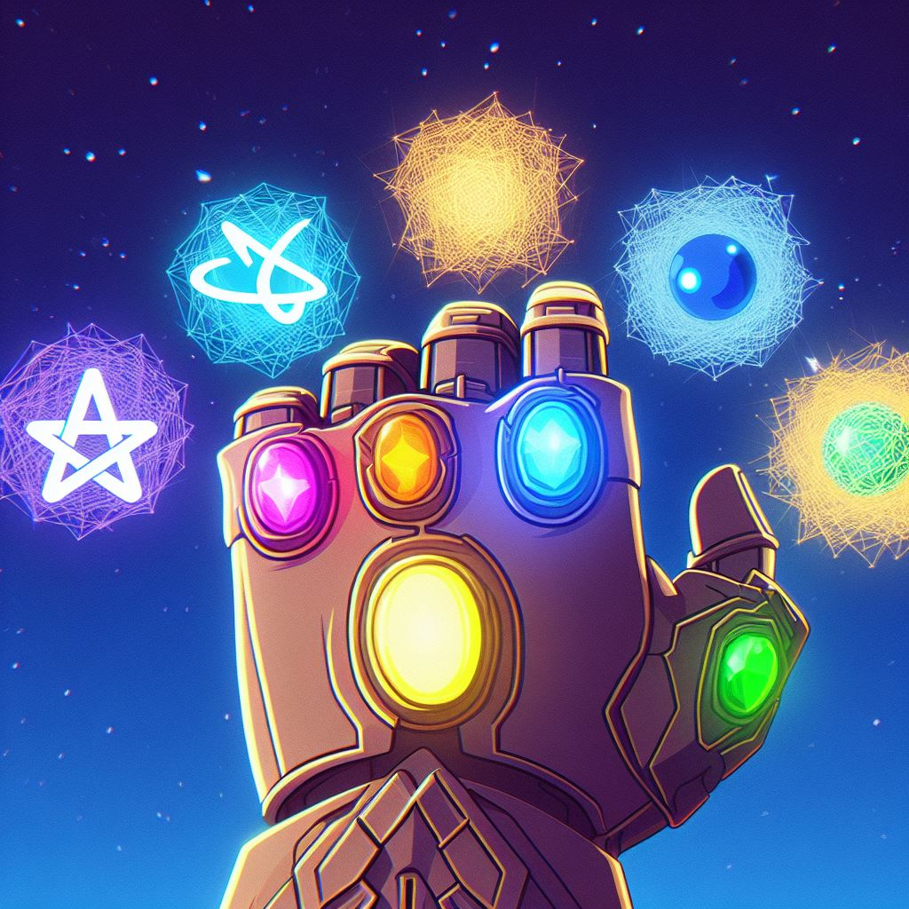

{/*  */}

 
 
## Introduction

I wasn't quite sure what area of Computer Science I wanted to devote my time, attention, and energy to.
I have always known I had enjoyed games, Art, 3D, and most recently I have started exploring different web technologies.
After all its such a broad field. What aspect would be relevant for this.
After doing some journaling and note-taking I found that I enjoyed a variety of things Coding and Problem solving, Animation, Design, Compositing, Story Telling.
This is what led me to

 
 

## Roadmap

I found that at the core. I enjoyed using Code, Design, and Animation to build visually engaging, interactive, and immersive experiences on the Web, and so I am dedicating the year
of 2024 to explore this crevix of reality. I have plotted out a roadmap for what my learning through out the year would look like.

 
 
 

| First Quarter (Jan - Mar) |          Resource          |     Project      |
| :-----------------------: | :------------------------: | :--------------: |
|           Astro           |    Astro Documentation     | Personal Website |
|            CSS            | Slaying the Dragon YouTube |                  |

Personal Project: (Build a Portfolio Website)

- Home Page: A Landing page that introduces me.
- Blog Page: to publicly document my learnings from across the Domains of Code, Design, Animation, Health, and Philosophy.
- Projects Page: To showcase sum of my GitHub Projects
- Shop: A page that links to my Lemon Squeezy shop where all my Digital Products are located.
   
   

| Second Quarter (Apr - Jun) |     Resource     |     Project      |
| :------------------------: | :--------------: | :--------------: |
|           React            | The Joy of React | Personal Website |
|     React-Three-Fiber      |   Wawa Sensei    |                  |
|          Blender           |

ThreeJS
GLSL / WGSL / WebGPU

C++ Programming
Mathematics for Game Developers
